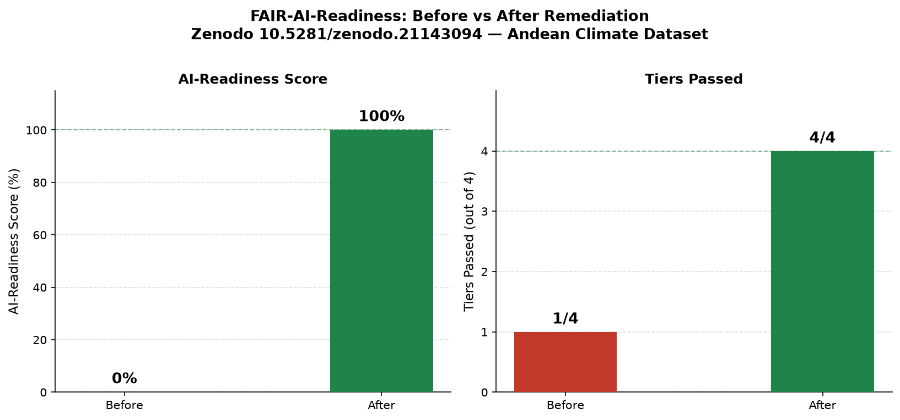

# FAIR AI-Readiness of Open Scientific Data: An Open Study and a Working Remediation

**A Tesseract Academy Report, 2 July 2026**

The Tesseract Academy (Fabio Rovai)
fabio@thetesseractacademy.com

**Repository:** https://github.com/fabio-rovai/fair-scientific-data (MIT Licence)
**Ontology:** https://w3id.org/fair-ai-ready (CC-BY 4.0)

---

## Executive Summary

We evaluated 1,738 real open-access datasets across three major repositories (EMBL-EBI BioStudies, 798 datasets; Dryad, 340; PRIDE/ProteomeXchange, 600) against a four-tiered FAIR AI-Readiness contract derived from the FAIRSCAPE framework [2], covering 28 criteria across the Findable, Accessible, Interoperable, Reusable, and AI-characterisation dimensions. The results define a sharp, universal threshold.

At the findability and accessibility layers, the picture is strong: 99.9% of datasets carry a persistent identifier, title, and description (Tier 1, Findable); 91.3% carry a downloadable distribution, creator, and publication date (Tier 2, Accessible and Reusable). At the interoperability and AI-readiness layers, the picture is absolute: 0% of datasets pass Tier 3 (machine-readable schema, version identifier, controlled-vocabulary subject), and 0% pass Tier 4 (AI-Ready: checksum, data dictionary, provenance, ethics, sample count). The gap is not incremental. It is a cliff.

To demonstrate that this gap is closeable, we took a real open dataset from 0% to 100% AI-readiness using our open toolkit and ontology. The Zenodo Andean climate dataset (DOI: 10.5281/zenodo.21143094), which failed Tiers 2 through 4 in its original form, was fully enriched to pass all four tiers. Every enrichment value (checksum, variable schema, sample count, provenance record, controlled-vocabulary subject) was derived from the real dataset file.

To make this gap systematically closeable, we contribute the FAIR AI-Ready Dataset (FAR) ontology: an OWL 2 vocabulary with 9 classes, 21 properties, and 42 alignment assertions to schema.org, DCAT 3, PROV-O, SPDX 2.3, and MLCommons Croissant, validated and certified via the open-ontologies pipeline (lint-clean, OWL-RL consistent). All code, shapes, corpus data, and the ontology are openly available under permissive licences.

---

## From 0% to 100%: Closing the Gap on a Real Dataset

The centrepiece of this work is not a theoretical argument: it is a worked remediation on a real public dataset, using only values that can be derived from the dataset itself.

### The dataset

The Zenodo Andean climate dataset (DOI: https://doi.org/10.5281/zenodo.21143094, title: "Monthly climate dataset of a dense high-Andean weather-station network in southern Ecuador, 2007-2026", creators: Franz Pucha-Cofrep and Andreas Fries) is a real, citable, open-access dataset published under CC-BY 4.0. It was selected because it is representative of real repository metadata in general: findable and accessible, but entirely missing the structural and provenance layer that AI pipelines require.

### Before enrichment

In its original form, the dataset fails Tiers 2 through 4:

| Tier | SHACL Violations (before) |
|---|---|
| T1 (Findable: PID, title, description) | 0 (passes) |
| T2 (Accessible + Reusable: distribution, creator, date) | 1: missing distribution with https contentUrl |
| T3 (Interoperable: controlled-vocabulary subject, variableMeasured, version) | 3 violations |
| T4 (AI-Ready: checksum, data dictionary, provenance, ethics, sample count) | 6 violations |

**AI-Readiness score before enrichment: 0% (0 of 4 tiers passing).**

### After enrichment

After enrichment using `src/remediate.py`, all four tiers pass with zero violations. Python semantic checks: 11/11 passed.

**AI-Readiness score after enrichment: 100% (4 of 4 tiers passing).**



### The enrichments (all real, derived from the dataset)

**Integrity checksum (FAIRSCAPE C4).** SHA-256 computed from `T_mensual.csv`:

```
6c2297659b146c4e9c4578c294c3aa7d39f727f6c7e79eee159095ca89ea3b41
```

**Variable schema and data dictionary (C6, C5).** The file carries 12 columns and 226 data rows:

| Column | Description | Unit |
|---|---|---|
| `month` | First day of observation month (ISO 8601 YYYY-MM-DD) | date |
| `MALCA1` | Monthly mean air temperature at station MALCA1 | degC |
| `Malacatos` | Monthly mean air temperature at station Malacatos | degC |
| `Militar` | Monthly mean air temperature at station Militar | degC |
| `UTPL` | Monthly mean air temperature at station UTPL | degC |
| `Epoca` | Monthly mean air temperature at station Epoca | degC |
| `Jipiro` | Monthly mean air temperature at station Jipiro | degC |
| `SanPedro` | Monthly mean air temperature at station SanPedro | degC |
| `Cajanuma` | Monthly mean air temperature at station Cajanuma | degC |
| `Tecnico` | Monthly mean air temperature at station Tecnico | degC |
| `Ventanas` | Monthly mean air temperature at station Ventanas | degC |
| `Villonaco` | Monthly mean air temperature at station Villonaco | degC |

Column names are read from the CSV header row of `T_mensual.csv`. Each column is encoded as a `far:VariableDefinition` within a `far:VariableSchema`, linked via `schema:variableMeasured` and collected into a `far:DataDictionary` referenced by `schema:hasPart`.

**Sample count (C11).** `schema:numberOfItems = 226` (real row count, excluding the CSV header).

**Controlled-vocabulary subject (I1).** `schema:about`: `http://purl.obolibrary.org/obo/ENVO_01001166` (ENVO term "climate", OBO Foundry Environmental Ontology).

**Data type IRI (C1).** `schema:additionalType`: `http://edamontology.org/format_3752` (EDAM term "CSV", tabular comma-separated data).

**Pipeline provenance (C9).** `prov:wasGeneratedBy`: `https://doi.org/10.5281/zenodo.21143094#quality-control-run-v2`, typed as `prov:Activity`, with `prov:wasAssociatedWith` pointing to the ORCID of the lead author.

**Ethics and de-identification (C8, C13).** `schema:conditionsOfAccess`: "Freely accessible under CC-BY 4.0. De-identification: not applicable (this is non-human environmental data; no personal data present). No IRB required." This statement is factually correct for this meteorological dataset.

**Creator ORCIDs (R1.2).** Franz Pucha-Cofrep: `https://orcid.org/0000-0002-5556-4028`; Andreas Fries: `https://orcid.org/0000-0001-5357-5682` (both from the Zenodo record).

The full enriched record is available as `examples_remediated/zenodo-21143094.after.jsonld` (JSON-LD) and `examples_remediated/zenodo-21143094.after.ttl` (Turtle). Validation reports (SHACL and Python semantic checks) are at `examples_remediated/zenodo-21143094.after.validation.md`.

---

## The Study: 1,738 Datasets, Three Repositories, Four Tiers

### Corpus

We evaluated 1,738 real dataset metadata records from three open-access repositories, fetched live on 2026-07-01 (full provenance in `CORPUS_REPORT.md` and `data/corpus/manifest.json`):

| Repository | N | Native format | Fetch method |
|---|---|---|---|
| Dryad | 340 | schema.org JSON-LD | Dryad API v2, content negotiation |
| EMBL-EBI BioStudies | 798 | BioStudies JSON (search API) | EBI BioStudies search endpoint |
| PRIDE/ProteomeXchange | 600 | PRIDE JSON (project API) | EBI PRIDE REST API |
| **Total** | **1,738** | | |

All 1,738 records normalised successfully (100%) to a common schema.org-based internal representation via `src/profiles.py`.

### Tier conformance

**Table 1. Tier conformance across 1,738 datasets.**

| Tier | Criterion class | Passed | N | Conformance rate |
|---|---|---|---|---|
| T1 | Findable (F1, F2-title, F2-desc) | 1,737 | 1,738 | **99.9%** |
| T2 | Accessible + Reusable (A1, R1.2-creator, R1.2-date) | 1,586 | 1,738 | **91.3%** |
| T3 | Interoperable + Schema-Structured (I1, C3, C6) | 0 | 1,738 | **0.0%** |
| T4 | AI-Ready (C1, C4, C5, C8, C9, C11) | 0 | 1,738 | **0.0%** |

Tiers are cumulative: a dataset passes Tier N only if it also passes all lower tiers. Keywords and machine-readable licence IRIs are reported as Warning sub-metrics and do not gate tier conformance.


**Table 2. Tier conformance by repository.**

| Repository | N | T1 Findable | T2 Accessible | T3 Interoperable | T4 AI-Ready |
|---|---|---|---|---|---|
| BioStudies | 798 | 100.0% (798/798) | 81.1% (647/798) | 0.0% | 0.0% |
| Dryad | 340 | 99.7% (339/340) | 99.7% (339/340) | 0.0% | 0.0% |
| PRIDE | 600 | 100.0% (600/600) | 100.0% (600/600) | 0.0% | 0.0% |

The headline finding is the cliff between Tier 2 and Tier 3. Foundational metadata (persistent identifier, title, description, creator, publication date, download URL) is nearly universal. The machine-readable structural and provenance layer that AI pipelines require is universally absent.

### Per-criterion failure rates

The failure is concentrated, not diffuse. The criteria that make a dataset machine-interpretable and auditable (a variable schema, integrity checksums, pipeline provenance, a data dictionary, a sample count, and ethics documentation) are absent from effectively every record, while findability criteria are satisfied almost everywhere. Table 3 and Figure 2 give the tier-gating (Violation) criteria, sorted descending: the interoperability and AI-readiness criteria cluster at 100%, and the findability criteria sit at 0%.

**Table 3. Failure rates for tier-gating (Violation) criteria, sorted descending.**

| Criterion | Tier | Failure rate | n fail / 1,738 | Description |
|---|---|---|---|---|
| **C6** | T3 | **100.0%** | 1,738 | Variables measured (schema:variableMeasured >= 1) |
| **C4** | T4 | **100.0%** | 1,738 | Integrity checksum (spdx:checksum or schema:sha256) |
| **C8** | T4 | **100.0%** | 1,738 | Ethics/IRB documented (schema:conditionsOfAccess) |
| **C9** | T4 | **100.0%** | 1,738 | Pipeline provenance (prov:wasGeneratedBy IRI) |
| **C11** | T4 | **100.0%** | 1,738 | Sample count (schema:numberOfItems >= 1 integer) |
| **C5** | T4 | **99.9%** | 1,737 | Data dictionary (schema:hasPart) |
| **C3** | T3 | **80.4%** | 1,398 | Version identifier (schema:version) |
| **I1** | T3 | **65.5%** | 1,138 | Controlled-vocab subject IRI (schema:about IRI) |
| **C1** | T4 | **65.5%** | 1,139 | Data type IRI (schema:additionalType IRI) |
| **A1** | T2 | **8.1%** | 140 | Distribution + https contentUrl (schema:distribution) |
| **R1.2-creator** | T2 | **0.6%** | 11 | Creator present (schema:creator) |
| **F2-desc** | T1 | **0.1%** | 1 | Description >= 20 chars |
| **F1** | T1 | **0.0%** | 0 | Globally unique PID |
| **F2-title** | T1 | **0.0%** | 0 | Title >= 5 chars |
| **R1.2-date** | T2 | **0.0%** | 0 | Publication date |


The practical implication is unambiguous: the FAIR-to-AI-ready gap is not a findability problem. F1 (globally unique PID) fails for zero records; F2-title and R1.2-date each fail at 0%. The failure is entirely located at the interoperability and provenance layer, and it is structural, not incidental. None of these concepts are supported fields in the catalogue-level API responses of any of the three repositories evaluated.

---

## The Remedy: The FAIR AI-Ready (FAR) Ontology

### Motivation

There is no existing single vocabulary that covers the full set of concepts required for AI-ready datasets (variable schema, data dictionary, provenance record, integrity check, ethics basis, sample characterisation, access specification) with precise semantics and validated alignments to the vocabularies that repositories already use. The FAR ontology fills this gap, following the design principle: compose, do not reinvent.

### Statistics

| Metric | Value |
|---|---|
| Raw triples | 238 |
| Triples after OWL-RL closure | 705 |
| Native classes | 9 |
| Native object properties | 12 |
| Native data properties | 9 |
| OWL restrictions on `far:AIReadyDataset` | 5 |
| External `rdfs:subClassOf` mappings | 11 |
| `skos:exactMatch` mappings | 7 |
| `skos:closeMatch` mappings | 22 |
| `skos:relatedMatch` mappings | 2 |
| **Total alignment assertions** | **42** |

**Namespace:** `https://w3id.org/fair-ai-ready/`
**Prefix:** `far:`
**Version:** 0.1.0 (2026-07-02)
**Licence:** CC-BY 4.0

### Native classes

Each class is empirically motivated: every Tier 3 and Tier 4 criterion that fails at 100% in the corpus corresponds to a native class or property designed to carry the missing information.

| Class | Label | FAIRSCAPE criteria addressed |
|---|---|---|
| `far:AIReadyDataset` | AI-Ready Dataset | F1-F4, A1-A2, I1-I3, R1-R1.3, C1-C11 |
| `far:VariableSchema` | Variable Schema | C6, I1, I2 |
| `far:VariableDefinition` | Variable Definition | C6, I1, I2 |
| `far:DataDictionary` | Data Dictionary | C5, C2, C7 |
| `far:ProvenanceRecord` | Provenance Record | C9, R1.2 |
| `far:IntegrityCheck` | Integrity Check | C4 |
| `far:EthicsBasis` | Ethics Basis | C8, C13 |
| `far:SampleCharacterization` | Sample Characterization | C7, C11, C12 |
| `far:AccessSpecification` | Access Specification | A1, A1.1, A1.2, R1.1 |

### Vocabulary alignments (selected)

Every native term is aligned to at least one external vocabulary (`subClassOf` = rdfs:subClassOf; `=` = skos:exactMatch; `approx` = skos:closeMatch):

| FAR class | schema.org | DCAT 3 | PROV-O | SPDX 2.3 | Croissant |
|---|---|---|---|---|---|
| `far:AIReadyDataset` | subClassOf schema:Dataset | subClassOf dcat:Dataset | subClassOf prov:Entity | | |
| `far:VariableDefinition` | subClassOf schema:PropertyValue | | | | = cr:Field |
| `far:DataDictionary` | subClassOf schema:CreativeWork | approx dcat:Distribution | | | approx cr:RecordSet |
| `far:ProvenanceRecord` | approx schema:Action | | subClassOf prov:Activity | | |
| `far:IntegrityCheck` | subClassOf schema:PropertyValue | | | = spdx:Checksum | |
| `far:EthicsBasis` | subClassOf schema:CreativeWork | | | | |

Selected property alignments: `far:hasProvenance` approx `prov:wasGeneratedBy`; `far:hasChecksum` = `spdx:checksum`; `far:sampleCount` = `schema:numberOfItems`; `far:checksumValue` = `spdx:checksumValue`.

### Certification

The ontology was validated via the open-ontologies certification pipeline: parse and structural validity (238 raw triples, 9 OWL classes, parsed without error); OWL-RL deductive closure (705 triples after closure, no inconsistency); lint (0 issues). **Outcome: validate OK, lint clean, OWL-RL consistent.**

### Relationship to the SHACL shapes

The OWL ontology (semantic layer) and the SHACL shapes in `shapes/` (validation layer) are complementary artefacts. The SHACL shapes enforce precise property paths, value patterns, and cardinalities on actual dataset metadata graphs; the OWL ontology captures class semantics, necessary conditions, and cross-vocabulary alignment. A dataset can be validated against the SHACL shapes without adopting the OWL ontology; the ontology provides the interoperability bridge for systems that consume or publish RDF linked data.

The tiered SHACL contract covers all 28 FAIRSCAPE criteria plus WRROC provenance (C9) and de-identification (C13). SHACL structural results and Python semantic checks were compared on a 30-record spot-check (10 per repository): agreement was 100% per tier, recorded in `results_deep/analysis.json` (`shacl_python_agreement`).

---

## What It Means for Research Data Platforms

The findings carry concrete, actionable implications for repositories and funders.

**The T3 blocker is a single missing field.** The entire corpus fails at Tier 3 because no repository exposes `schema:variableMeasured` in its catalogue-level metadata. Repositories have already adopted schema.org for discoverability: identifier, title, description, creator, and date are near-universal. The richer characterisation properties that ML pipelines require (`schema:variableMeasured`, `schema:additionalType` as an ontology IRI, `schema:hasPart` for data dictionaries, `schema:numberOfItems`) remain entirely unpopulated. Adding a variable description field to deposit workflows is the single highest-leverage change any repository could make.

**PRIDE demonstrates that 100% T1 and T2 is achievable.** PRIDE achieves 100% on both tiers. Its organism mappings (NEWT organism accessions to NCBI taxonomy IRIs) show that IRI-based classification is already embedded in the PRIDE data model. The barrier to T3 within PRIDE is exclusively at the variable-description and version layers (C6, C3), which would require changes to the deposit workflow rather than to the metadata export format.

**Dryad is closest to actionable T3 compliance.** Dryad achieves 99.7% at T2 through its schema.org JSON-LD exports. Its path to T3 requires two changes: (a) mapping its plain-text `fieldOfScience` subject field to IRI-based controlled vocabulary terms (MeSH, EDAM, or OBO ontologies) to satisfy I1, and (b) populating `schema:variableMeasured` at deposit time.

**BioStudies has a platform-level API exposure gap.** The BioStudies search API does not surface keyword metadata or file-download URLs for approximately 17.5% of records, even though both may exist in the full study record. A secondary harvest via the per-accession study endpoint would likely substantially improve BioStudies' T2 rate.

**T4 requires deposit workflow changes, not formatting adjustments.** Achieving AI-Readiness (Tier 4) requires depositing researchers to provide: (a) a data dictionary or variable definitions; (b) an ethics or IRB statement with a structured reference; (c) a provenance record linking the dataset to its generating workflow; and (d) integrity checksums on distributed files. The FAR ontology provides the vocabulary for encoding these; the SHACL shapes provide the machine validation contract for verifying them.

**Low-cost, high-impact sub-metric fixes exist.** Keywords (F2-kw) are absent from 47.6% of all records. Machine-readable licence IRIs (R1.1) fail at 73.1% overall: replacing the PRIDE string "EBI terms of use" with a canonical CC-BY IRI would bring R1.1 compliance within PRIDE from 21.3% to near 100% with a single mapping change.

---

## Methods

### Corpus construction

1,738 real dataset metadata records were fetched from three open-access repositories on 2026-07-01 (Dryad API v2 content negotiation; EBI BioStudies search API; EBI PRIDE REST API). All records were normalised to a common schema.org-based internal representation by `src/profiles.py` (100% normalisation success rate).

### Validation contract

A four-tiered SHACL contract (`shapes/tier-1-findable.ttl` through `shapes/tier-4-ai-ready.ttl`) covers all 28 FAIRSCAPE criteria plus WRROC provenance and de-identification extensions. Tiers are cumulative. Eleven criteria not fully expressible in SHACL are covered by Python semantic checks in `src/checks.py` (DOI/ARK/Handle format, SPDX licence recognition, ORCID format, SHA-256 validation, statistical-summary scanning, etc.). SHACL and Python results were compared on a 30-record spot-check (10 per repository): 100% agreement per tier.

### Remediation

The remediation script `src/remediate.py` enriches a normalised JSON-LD record by computing real values from the dataset file (SHA-256 checksum, column schema from CSV header, row count) and adding structured metadata (controlled-vocabulary IRIs, provenance record, ethics statement). Output is validated against all four SHACL tiers and all Python semantic checks.

---

## Limitations

**Catalogue metadata only.** We evaluate catalogue-level metadata records exposed via each repository's API, not the datasets themselves or supplementary files. Variable descriptions, data dictionaries, ethics statements, and provenance information may exist in supplementary documents not indexed in the API metadata record. Our T3 and T4 failure rates measure a genuine FAIR gap (machine-readable metadata should be separately accessible from the data it describes) but may overstate the real-world absence of these artefacts.

**Zenodo not included.** All eight Zenodo API queries timed out during corpus construction (2026-07-01); Zenodo is excluded. As one of the largest general-purpose open repositories, its inclusion would expand corpus diversity. Zenodo's schema.org JSON-LD exports are structurally rich; inclusion would likely improve T1 and T2 rates but is unlikely to change the T3/T4 picture given the absence of `variableMeasured`, checksum, and provenance fields in Zenodo's standard export.

**Sample size and stratification.** The three repository samples (340, 798, 600) were drawn without stratification by discipline, publication year, or dataset size. Repository-level comparisons should be interpreted accordingly.

**Keyword and licence as sub-metrics.** F2-kw (keywords) and R1.1 (machine-readable licence IRI) are treated as Warning sub-metrics and do not gate tier conformance. Alternative interpretations that treat licence as a strict Violation gate would reduce T2 conformance rates to 26.9% overall.

**Python semantic check spot-check scope.** Python semantic checks were validated on 30 records. Systematic differences between the SHACL structural check and the Python semantic check may exist in the full corpus; our spot-check shows 100% agreement per tier but cannot rule out edge cases at scale.

---

## Availability

| Artefact | Location | Licence |
|---|---|---|
| Full codebase, shapes, corpus, results | https://github.com/fabio-rovai/fair-scientific-data | MIT |
| FAR ontology | https://w3id.org/fair-ai-ready | CC-BY 4.0 |
| Corpus provenance | `CORPUS_REPORT.md` (records fetched 2026-07-01) | |
| Computed results | `results_deep/` (generated 2026-07-02) | |
| SHACL shape files | `shapes/tier-1-findable.ttl` to `shapes/tier-4-ai-ready.ttl` | MIT |
| Criteria-to-tier mapping | `FAIRSCAPE_CRITERIA_MAP.md` | MIT |
| Python semantic checks | `src/checks.py` | MIT |
| Remediation script | `src/remediate.py` | MIT |
| Remediated example (before/after) | `examples_remediated/` | MIT |

---

## References

[1] Wilkinson MD, Dumontier M, Aalbersberg IJ, et al. "The FAIR Guiding Principles for scientific data management and stewardship." *Scientific Data* 3:160018, 2016. https://doi.org/10.1038/sdata.2016.18

[2] Al Manir S, Clark T, et al. "The FAIRSCAPE AI-readiness Framework for Biomedical Research." *bioRxiv* 2024.12.23.629818, v4 March 2026. PMCID: PMC11703166. https://doi.org/10.1101/2024.12.23.629818

[3] Caufield JH, Munoz-Torres MC, et al. "Standards in the Preparation of Biomedical Research Metadata: A Bridge2AI Perspective." *arXiv* 2509.10432, September 2025. https://arxiv.org/abs/2509.10432

[4] Leo S, Crusoe MR, Rodriguez-Navas L, Soiland-Reyes S, et al. "Recording provenance of workflow runs with RO-Crate." *PLOS ONE* 19(9):e0309210, 2024. https://doi.org/10.1371/journal.pone.0309210

[5] Cortes KG, Sundar S, Gehrke S, et al. "Improving Biomedical Knowledge Graph Quality: A Community Approach." *arXiv* 2508.21774, 2025. https://arxiv.org/abs/2508.21774

[6] Bioschemas Community. "Dataset Profile 1.0-RELEASE." https://bioschemas.org/profiles/Dataset/1.0-RELEASE (accessed 2026-07-02).

[7] DataCite Metadata Working Group. "DataCite Metadata Schema Documentation for the Publication and Citation of Research Data and Other Research Outputs." Version 4.5. DataCite, 2024. https://doi.org/10.14454/g8e5-6293

[8] Akhtar M, Benjelloun O, Conforti C, et al. "Croissant: A Metadata Format for ML-Ready Datasets." *arXiv* 2403.19546, 2024. https://arxiv.org/abs/2403.19546

[9] Albertoni R, Browning D, Cox S, et al. "Data Catalog Vocabulary (DCAT), Version 3." W3C Recommendation 2024-08-22. https://www.w3.org/TR/vocab-dcat-3/

[10] Lebo T, Sahoo S, McGuinness D, et al. "PROV-O: The PROV Ontology." W3C Recommendation 2013-04-30. https://www.w3.org/TR/prov-o/

[11] SPDX Workgroup. "SPDX Specification 2.3." Linux Foundation, 2022. https://spdx.github.io/spdx-spec/v2.3/
