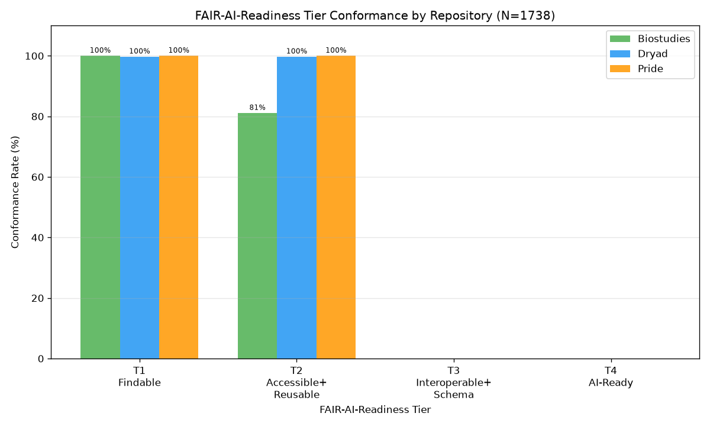
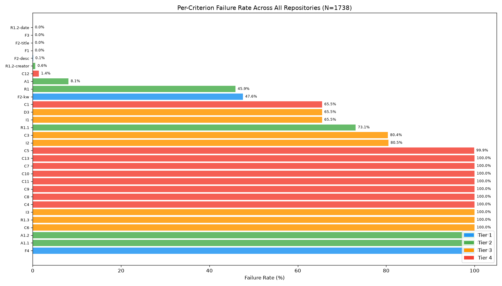
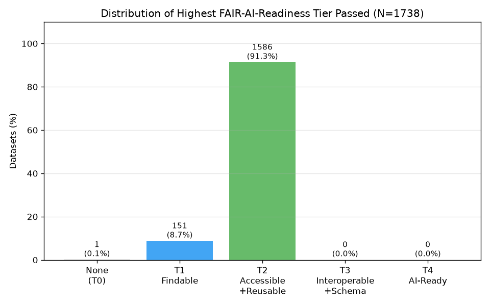
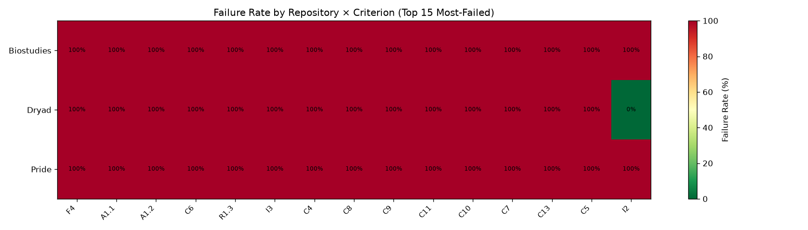

# FAIR-AI-Readiness Corpus Analysis Results

**Generated:** 2026-07-02  |  **Corpus:** 1738 datasets  |  **Successfully normalized:** 1738

## 1. Normalization Success

| Repository | Normalized | Total | Rate |
|---|---|---|---|
| Biostudies | 798 | 798 | 100.0% |
| Dryad | 340 | 340 | 100.0% |
| Pride | 600 | 600 | 100.0% |
| **Total** | **1738** | **1738** | **100.0%** |

## 2. Tier Conformance — Overall

| Tier | Criterion Class | Passed | Total | Conformance Rate |
|---|---|---|---|---|
| T1 | Findable (F1–F4) | 1737 | 1738 | **99.9%** |
| T2 | Accessible + Reusable (A1, R1.1–R1.2) | 1586 | 1738 | **91.3%** |
| T3 | Interoperable + Schema-Structured (I1, C3, C6) | 0 | 1738 | **0.0%** |
| T4 | AI-Ready (C1, C4, C5, C8, C9, C11) | 0 | 1738 | **0.0%** |

## 3. Tier Conformance — Per Repository

| Repository | N | T1 Findable | T2 Accessible | T3 Interoperable | T4 AI-Ready |
|---|---|---|---|---|---|
| Biostudies | 798 | 100.0% | 81.1% | 0.0% | 0.0% |
| Dryad | 340 | 99.7% | 99.7% | 0.0% | 0.0% |
| Pride | 600 | 100.0% | 100.0% | 0.0% | 0.0% |

## 4. Per-Criterion Failure Rates

| Criterion | Description | Tier | Failures | N | Failure Rate |
|---|---|---|---|---|---|
| F4 | Registered in catalogue (schema:includedInDataCatalog) | T1 | 1738 | 1738 | **100.0%** |
| A1.1 | Access conditions declared (schema:conditionsOfAccess) | T2 | 1738 | 1738 | **100.0%** |
| A1.2 | Contact point (schema:contactPoint) | T2 | 1738 | 1738 | **100.0%** |
| C6 | Variable measured (schema:variableMeasured ≥1) | T3 | 1738 | 1738 | **100.0%** |
| R1.3 | Conforms to community standard (schema:isBasedOn) | T3 | 1738 | 1738 | **100.0%** |
| I3 | Qualified reference (schema:isBasedOn IRI) | T3 | 1738 | 1738 | **100.0%** |
| C4 | Checksum on distribution (spdx:checksum or schema:sha256) | T4 | 1738 | 1738 | **100.0%** |
| C8 | Ethics/IRB documented (schema:conditionsOfAccess) | T4 | 1738 | 1738 | **100.0%** |
| C9 | Pipeline provenance (prov:wasGeneratedBy IRI) | T4 | 1738 | 1738 | **100.0%** |
| C11 | Sample count (schema:numberOfItems ≥1 integer) | T4 | 1738 | 1738 | **100.0%** |
| C10 | Software reference (schema:softwareRequirements) | T4 | 1738 | 1738 | **100.0%** |
| C7 | Stats summary (schema:variableMeasured ≥2) | T4 | 1738 | 1738 | **100.0%** |
| C13 | De-identification (schema:conditionsOfAccess) | T4 | 1738 | 1738 | **100.0%** |
| C5 | Data dictionary (schema:hasPart) | T4 | 1737 | 1738 | **99.9%** |
| I2 | Language declared (schema:inLanguage) | T3 | 1399 | 1738 | **80.5%** |
| C3 | Version identifier (schema:version) | T3 | 1398 | 1738 | **80.4%** |
| R1.1 | Machine-readable licence IRI (schema:license) | T2 | 1270 | 1738 | **73.1%** |
| I1 | Controlled vocab subject IRI (schema:about as IRI) | T3 | 1138 | 1738 | **65.5%** |
| D3 | Measurement technique (schema:measurementTechnique) | T3 | 1138 | 1738 | **65.5%** |
| C1 | Data type IRI (schema:additionalType IRI) | T4 | 1139 | 1738 | **65.5%** |
| F2-kw | Keywords present (schema:keywords) | T1 | 828 | 1738 | **47.6%** |
| R1 | Publisher declared (schema:publisher) | T2 | 798 | 1738 | **45.9%** |
| A1 | Distribution with http(s) contentUrl (schema:distribution) | T2 | 140 | 1738 | **8.1%** |
| C12 | Completeness/missingness (description ≥100 chars) | T4 | 24 | 1738 | **1.4%** |
| R1.2-creator | Creator present (schema:creator) | T2 | 11 | 1738 | **0.6%** |
| F2-desc | Description ≥20 chars (schema:description) | T1 | 1 | 1738 | **0.1%** |
| F1 | Globally unique PID (schema:identifier) | T1 | 0 | 1738 | **0.0%** |
| F2-title | Title ≥5 chars (schema:name) | T1 | 0 | 1738 | **0.0%** |
| F3 | Landing page IRI (schema:url) | T1 | 0 | 1738 | **0.0%** |
| R1.2-date | Publication date (schema:datePublished) | T2 | 0 | 1738 | **0.0%** |

## 5. Top-5 Most-Failed Criteria

| Rank | Criterion | Failure Rate | Description |
|---|---|---|---|
| 1 | F4 | 100.0% | Registered in catalogue (schema:includedInDataCatalog) |
| 2 | A1.1 | 100.0% | Access conditions declared (schema:conditionsOfAccess) |
| 3 | A1.2 | 100.0% | Contact point (schema:contactPoint) |
| 4 | C6 | 100.0% | Variable measured (schema:variableMeasured ≥1) |
| 5 | R1.3 | 100.0% | Conforms to community standard (schema:isBasedOn) |

## 6. Highest Tier Distribution

| Highest Tier | Count | Percentage |
|---|---|---|
| None (failed T1) | 1 | 0.1% |
| T1 Findable | 151 | 8.7% |
| T2 Accessible+Reusable | 1586 | 91.3% |

## 7. Figures

